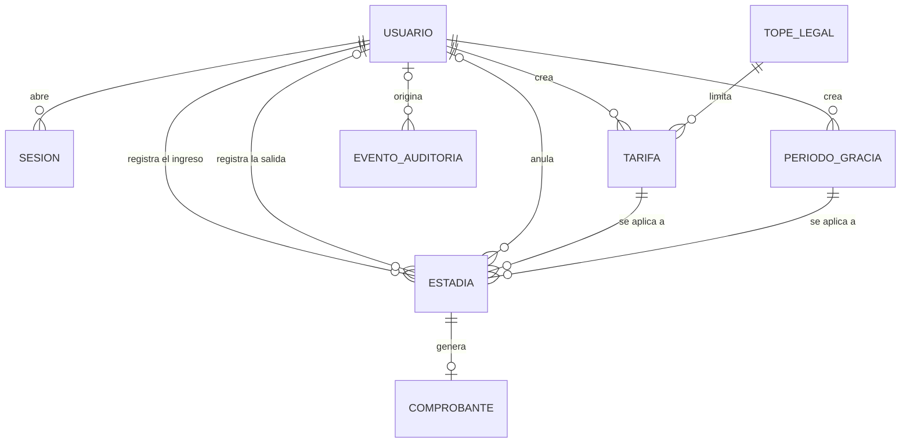

# Modelo de datos

| Campo | Valor |
|---|---|
| Proyecto | ParkApp — Sistema de Gestión de Parqueaderos |
| Tarea | S1-04 (#5) |
| Versión | 0.1 — 10 de octubre de 2026 (en construcción) |

Este documento se deriva de los requisitos (`docs/requisitos.md`) y de las
reglas de negocio (`docs/reglas-de-negocio.md`). Se desarrolla en tres niveles:
conceptual (qué entidades existen y cómo se relacionan), lógico (atributos,
claves y restricciones) y físico (esquema de Prisma sobre PostgreSQL).

## 1. Modelo conceptual

### 1.1 Entidades

| Entidad | Qué representa | Requisitos |
|---|---|---|
| Usuario | Persona que usa el sistema, con rol de operador o administrador. Se desactiva, nunca se borra. | FR-01 a FR-06 |
| Sesión | Sesión abierta de un usuario. Permite expirarla y revocarla de inmediato. | FR-01, FR-02, NFR-04 |
| Tope legal | Valor máximo por minuto aplicable al parqueadero, por tipo de vehículo, con la norma que lo origina. Solo cambia por migración. | BR-10, BR-15, FR-16 |
| Tarifa | Valor por minuto que cobra el parqueadero, por tipo de vehículo. Cada cambio crea una versión nueva. | BR-09, BR-10, BR-11, FR-16 |
| Periodo de gracia | Minutos iniciales sin cobro. Cada cambio crea una versión nueva. | BR-08, BR-11, FR-17 |
| Estadía | Paso de un vehículo por el parqueadero: datos del vehículo observados al ingreso, ingreso, salida y, si aplica, anulación. | BR-01 a BR-04, BR-11 a BR-13, BR-16; FR-07 a FR-12, FR-15 |
| Comprobante | Constancia del cobro de una estadía cerrada, con los valores aplicados. | BR-05 a BR-07, BR-14; FR-13, FR-14 |
| Evento de auditoría | Registro inmutable de una acción: quién, qué, cuándo y desde qué IP. | FR-19, NFR-03, NFR-05, NFR-12 |

FR-10, FR-11, FR-18 y FR-20 son consultas sobre Estadía y Comprobante; no
requieren entidades propias.

### 1.2 Diagrama

### 1.3 Decisiones de modelado

1. **No hay entidad Vehículo.** Los datos del vehículo (placa, tipo, color y
   marca) se guardan en cada estadía tal como se observaron al ingreso, y la
   verificación de salida (BR-04) se hace contra esa observación. No es
   redundancia: en el dominio, la placa no determina el color ni la marca. Una
   placa clonada (BR-03) son dos vehículos físicos con la misma placa, y una
   tabla de vehículos con la placa como clave los mezclaría en uno solo. Ningún
   requisito necesita un perfil de vehículo; las mensualidades están fuera de
   alcance.
2. **Las sesiones se guardan en el servidor.** NFR-04 exige que cerrar sesión o
   desactivar una cuenta invalide el acceso de inmediato, lo que solo es posible
   si el servidor consulta el estado de la sesión en cada petición. El mecanismo
   de transporte se decide en la arquitectura (S1-06).
3. **El sistema atiende un solo parqueadero**, como establece el anteproyecto.
   Por eso no hay entidad Parqueadero: el tope legal guarda el valor aplicable a
   este parqueadero, incluida la condición de Sello Oro y la norma que lo origina
   (BR-15). Atender varios parqueaderos queda en el backlog del producto.
4. **Toda salida genera un comprobante, aunque el cobro sea $0** por el periodo
   de gracia. Así, cada estadía cerrada tiene exactamente un comprobante, y el
   resumen de recaudo (FR-20) cuadra con las salidas registradas. El comprobante
   es una entidad propia porque es un documento con numeración consecutiva y
   con los valores cobrados, distinto del hecho de la estadía.
5. **La anulación es parte de la estadía.** Anular una estadía anula también su
   comprobante, si lo tiene (FR-15). Una estadía activa también se puede anular
   si se registró por error.

## 2. Modelo lógico

Pendiente.

## 3. Modelo físico

Pendiente.

## 4. Diccionario de datos

Pendiente.
