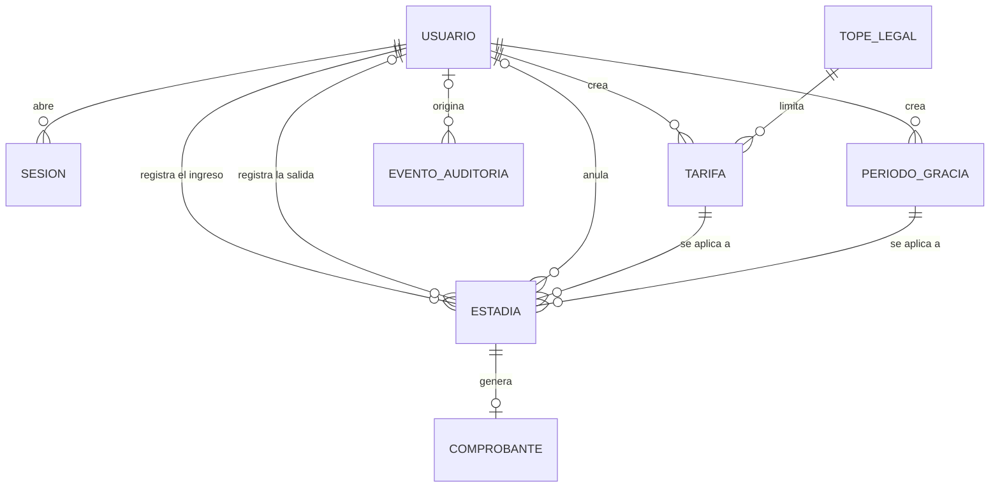
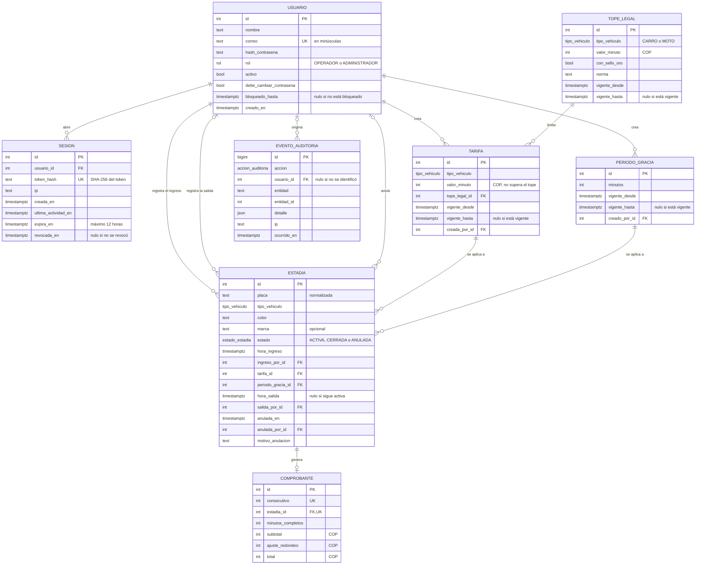

# Modelo de datos

| Campo | Valor |
|---|---|
| Proyecto | ParkApp — Sistema de Gestión de Parqueaderos |
| Tarea | S1-04 (#5) |
| Versión | 0.1 — 10 de octubre de 2026 (en construcción) |

Este documento se deriva de los requisitos (`docs/requisitos.md`) y de las
reglas de negocio (`docs/reglas-de-negocio.md`). Se desarrolla en tres niveles:
conceptual (qué entidades existen y cómo se relacionan), lógico (atributos,
claves y restricciones) y físico (esquema de Prisma sobre PostgreSQL).

## 1. Modelo conceptual

### 1.1 Entidades

| Entidad | Qué representa | Requisitos |
|---|---|---|
| Usuario | Persona que usa el sistema, con rol de operador o administrador. Se desactiva, nunca se borra. | FR-01 a FR-06 |
| Sesión | Sesión abierta de un usuario. Permite expirarla y revocarla de inmediato. | FR-01, FR-02, NFR-04 |
| Tope legal | Valor máximo por minuto aplicable al parqueadero, por tipo de vehículo, con la norma que lo origina. Solo cambia por migración. | BR-10, BR-15, FR-16 |
| Tarifa | Valor por minuto que cobra el parqueadero, por tipo de vehículo. Cada cambio crea una versión nueva. | BR-09, BR-10, BR-11, FR-16 |
| Periodo de gracia | Minutos iniciales sin cobro. Cada cambio crea una versión nueva. | BR-08, BR-11, FR-17 |
| Estadía | Paso de un vehículo por el parqueadero: datos del vehículo observados al ingreso, ingreso, salida y, si aplica, anulación. | BR-01 a BR-04, BR-11 a BR-13, BR-16; FR-07 a FR-12, FR-15 |
| Comprobante | Constancia del cobro de una estadía cerrada, con los valores aplicados. | BR-05 a BR-07, BR-14; FR-13, FR-14 |
| Evento de auditoría | Registro inmutable de una acción: quién, qué, cuándo y desde qué IP. | FR-19, NFR-03, NFR-05, NFR-12 |

FR-10, FR-11, FR-18 y FR-20 son consultas sobre Estadía y Comprobante; no
requieren entidades propias.

### 1.2 Diagrama

### 1.3 Decisiones de modelado

1. **No hay entidad Vehículo.** Los datos del vehículo (placa, tipo, color y
   marca) se guardan en cada estadía tal como se observaron al ingreso, y la
   verificación de salida (BR-04) se hace contra esa observación. No es
   redundancia: en el dominio, la placa no determina el color ni la marca. Una
   placa clonada (BR-03) son dos vehículos físicos con la misma placa, y una
   tabla de vehículos con la placa como clave los mezclaría en uno solo. Ningún
   requisito necesita un perfil de vehículo; las mensualidades están fuera de
   alcance.
2. **Las sesiones se guardan en el servidor.** NFR-04 exige que cerrar sesión o
   desactivar una cuenta invalide el acceso de inmediato, lo que solo es posible
   si el servidor consulta el estado de la sesión en cada petición. El mecanismo
   de transporte se decide en la arquitectura (S1-06).
3. **El sistema atiende un solo parqueadero**, como establece el anteproyecto.
   Por eso no hay entidad Parqueadero: el tope legal guarda el valor aplicable a
   este parqueadero, incluida la condición de Sello Oro y la norma que lo origina
   (BR-15). Atender varios parqueaderos queda en el backlog del producto.
4. **Toda salida genera un comprobante, aunque el cobro sea $0** por el periodo
   de gracia. Así, cada estadía cerrada tiene exactamente un comprobante, y el
   resumen de recaudo (FR-20) cuadra con las salidas registradas. El comprobante
   es una entidad propia porque es un documento con numeración consecutiva y
   con los valores cobrados, distinto del hecho de la estadía.
5. **La anulación es parte de la estadía.** Anular una estadía anula también su
   comprobante, si lo tiene (FR-15). Una estadía activa también se puede anular
   si se registró por error.

## 2. Modelo lógico

### 2.1 Convenciones

- Nombres en español, en minúscula, con guion bajo y sin tildes (`hora_ingreso`).
- Identificadores enteros secuenciales.
- Dinero en pesos colombianos enteros, sin decimales.
- Fechas y horas con zona horaria, siempre asignadas por el servidor (BR-16).
- Las entidades versionadas (tope legal, tarifa y periodo de gracia) usan
  `vigente_desde` y `vigente_hasta`; `vigente_hasta` nulo indica la versión
  vigente.
- El tipo, la obligatoriedad y la descripción de cada atributo se detallan en
  el diccionario de datos (sección 4).

### 2.2 Diagrama

### 2.3 Reglas de integridad

Cada regla se implementa en PostgreSQL y se verifica con pruebas automatizadas
en S1-05.

| ID | Regla | Origen |
|---|---|---|
| RI-01 | La placa se guarda en mayúsculas, sin espacios ni guiones, con el formato de su tipo: tres letras y tres números para carro; tres letras, dos números y una letra para moto. | BR-02, FR-08 |
| RI-02 | Una placa tiene como máximo una estadía activa. | BR-03, FR-09 |
| RI-03 | El estado de la estadía es coherente con sus datos: una activa no tiene salida; una cerrada tiene hora y usuario de salida; una anulada tiene fecha, usuario y motivo de anulación. | BR-12, FR-15 |
| RI-04 | Las únicas transiciones de estado válidas son de activa a cerrada, de activa a anulada y de cerrada a anulada. Una estadía anulada no cambia. | BR-12 |
| RI-05 | La hora de salida no es anterior a la de ingreso. | BR-16 |
| RI-06 | La tarifa de la estadía corresponde a su tipo de vehículo. La tarifa y el periodo de gracia son los vigentes al momento del ingreso. | BR-11 |
| RI-07 | Hay como máximo una versión vigente de tarifa y de tope legal por tipo de vehículo, y una de periodo de gracia. En toda versión, `vigente_hasta` es posterior a `vigente_desde`. | BR-11, BR-15 |
| RI-08 | Las versiones de tope legal, tarifa y periodo de gracia no se modifican; solo se cierran, una sola vez. | BR-11, BR-15 |
| RI-09 | La tarifa vigente es mayor que cero y no supera el tope legal vigente de su tipo de vehículo. Se verifica al crear una tarifa y al cambiar un tope. | BR-10, BR-15 |
| RI-10 | El periodo de gracia es un número entero de minutos mayor o igual a cero. | BR-08, US-12 |
| RI-11 | Toda estadía con salida registrada tiene exactamente un comprobante, y solo esas estadías lo tienen. La salida y el comprobante se registran en la misma transacción. | FR-13, FR-14 |
| RI-12 | En el comprobante, el total es el subtotal menos el ajuste por redondeo, el ajuste está entre $0 y $49, y el total es múltiplo de $50. Una vez emitido, no se modifica. | BR-06, BR-07, BR-12 |
| RI-13 | No se borran usuarios, estadías ni comprobantes. | BR-12; requisitos, sección 1.3 |
| RI-14 | La bitácora de auditoría es de solo inserción, y ningún evento guarda contraseñas ni tokens. | NFR-12 |
| RI-15 | El correo de cada usuario es único, sin distinguir mayúsculas de minúsculas. | FR-01 |
| RI-16 | Una contraseña restablecida por el administrador debe cambiarse en el siguiente inicio de sesión. | FR-05; requisitos, sección 1.3 |

### 2.4 Decisiones del modelo lógico

1. **Identificadores enteros secuenciales.** El control de acceso es por rol,
   no por propiedad del registro: un operador puede consultar cualquier estadía
   activa. La seguridad no depende de que los identificadores sean difíciles de
   adivinar, sino de que la API verifique el rol en cada petición (NFR-05).
2. **Una contraseña restablecida debe cambiarse** (RI-16). Si el administrador
   conociera la contraseña de un operador, podría actuar en su nombre, y se
   perdería la trazabilidad de quién hizo cada registro.
3. **Un cambio de tope no puede dejar ilegal la tarifa vigente** (RI-09). La
   migración que cambia un tope falla si la tarifa vigente lo supera; primero el
   administrador ajusta su tarifa. El sistema nunca cambia precios por su cuenta.
4. **El token de sesión se guarda como hash.** El cliente recibe un token
   aleatorio y la base solo guarda su huella SHA-256. Si la base se filtra, las
   sesiones activas no se pueden usar.
5. **El comprobante guarda los resultados del cálculo, no sus parámetros.**
   Minutos, subtotal, ajuste y total quedan fijos al emitirse, para que un cambio
   futuro en el código de cálculo no altere comprobantes ya emitidos. La tarifa y
   la gracia aplicadas no se copian: se obtienen de la estadía, y sus versiones
   son inmutables (RI-08).
6. **Los intentos fallidos se cuentan en la bitácora.** El bloqueo de NFR-03 se
   calcula con los eventos de inicio de sesión fallido de los últimos 15 minutos;
   el usuario solo guarda hasta cuándo está bloqueado.

## 3. Modelo físico

Pendiente.

## 4. Diccionario de datos

Pendiente.
